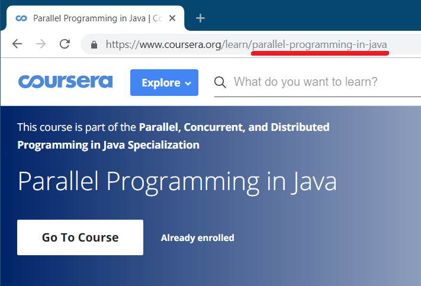
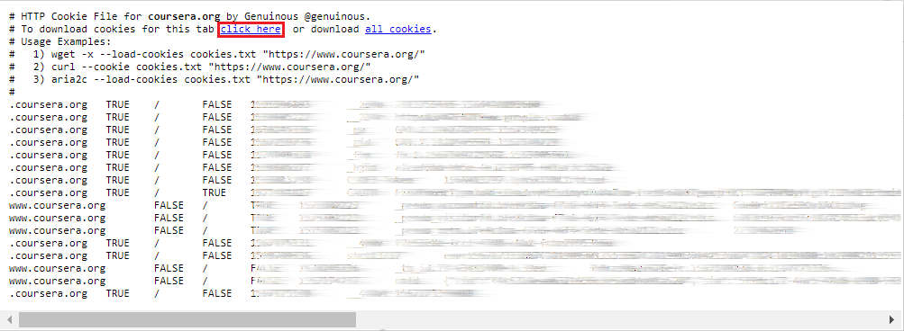
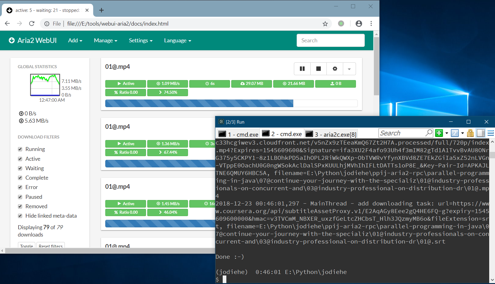
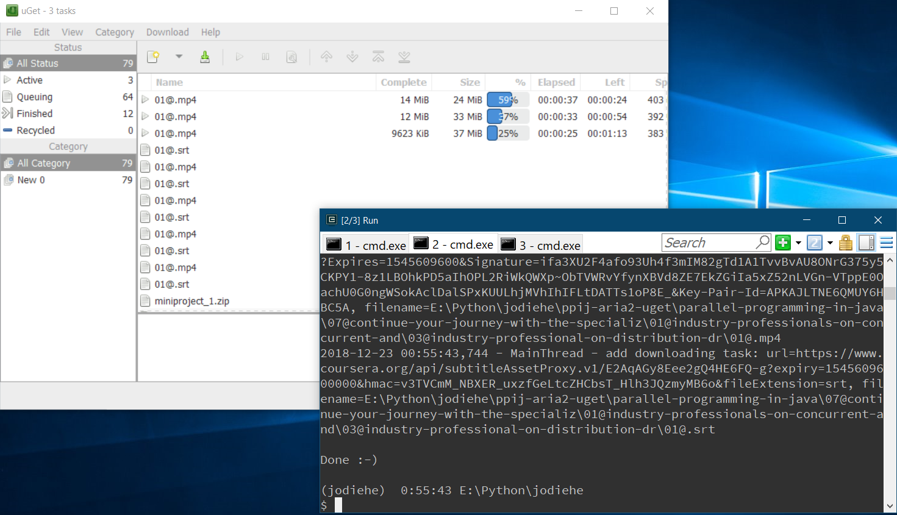

A simple, fast, and reliable Coursera crawling & downloading tool

## Todo

- [x] Lectures (videos, subtitles, slides)
- [x] Readings
- [ ] Quizs
- [ ] Jupyter notebooks

## Install

> Python 3.x is required. It is recommended to install this tool in a virtual environment

```
$ pip install dl_coursera
$ dl_coursera --version
```

## How to use

```
$ dl_coursera --help
usage: dl_coursera [-h] [--version] [--email EMAIL] [--password PASSWORD]
                   [--cookies COOKIES] --slug SLUG [--isSpec]
                   [--n-worker N_WORKER] [--outdir OUTDIR] --how
                   {builtin,curl,aria2,aria2-rpc,uget} [--generate-input-file]
                   [--aria2-rpc-url ARIA2_RPC_URL]
                   [--aria2-rpc-secret ARIA2_RPC_SECRET]

A simple, fast, and reliable Coursera crawling & downloading tool

optional arguments:
  -h, --help            show this help message and exit
  --version             show program's version number and exit
  --email EMAIL
  --password PASSWORD
  --cookies COOKIES     path of the file which contains cookies in the Mozilla
                        `cookies.txt` file format
  --slug SLUG           slug of a course or a specializtion (with @--isSpec)
  --isSpec              indicate that @slug is slug of a specialization
  --n-worker N_WORKER   the number of threads used to crawl webpages. Default:
                        4. NOTE: if errors show up during crawling, try
                        decreasing this value
  --outdir OUTDIR       the directory to save files to. Default: `.'
  --how {builtin,curl,aria2,aria2-rpc,uget}
                        how to download files. builtin (NOT recommonded): use
                        the builtin downloader. curl: invoke the `curl' tool
                        or generate an "input file" for that tool (with
                        @--generate-input-file). aria2: invoke the `aria2c'
                        tool or generate an "input file" for that tool (with
                        @--generate-input-file). aria2-rpc (HIGHLY
                        recommonded): add downloading tasks to aria2 through
                        its XML-RPC interface. uget (recommonded): add
                        downloading tasks to the uGet Download Manager
  --generate-input-file
                        when @--how is curl/aria2, indicate that to generate
                        an "input file" for that tool, rather than to invoke
                        it
  --aria2-rpc-url ARIA2_RPC_URL
                        url of the aria2 XML-RPC interface. Default:
                        `http://localhost:6800/rpc'
  --aria2-rpc-secret ARIA2_RPC_SECRET
                        authorization token of the aria2 XML-RPC interface

If the command succeeds, you shall see `Done :-)'. If some UNEXPECTED errors
occur, try deleting everything generated by this tool in @outdir, and then run
the command again. For more information, visit `https://github.com/feng-
lei/dl_coursera'.
```

### How to know slug of a course/specialization

Navigate to homepage of that course/specialization, you can see its slug at the address bar.



### How to get the *cookies.txt* file

Sign in to [Coursera](https://www.coursera.org/), then use a browser extension to export cookies as *cookies.txt*. The *cookies.txt* will expire in about one month, so you do not need to do this so frequently.

#### Chrome

You can use the [cookies.txt](https://chrome.google.com/webstore/detail/cookiestxt/njabckikapfpffapmjgojcnbfjonfjfg) extension.



#### Firefox

You can use the [Export Cookies](https://addons.mozilla.org/en-US/firefox/addon/export-cookies-txt/?src=search) extension.


## Examples

> (**2019/08/30**) Since Coursera has changed its login API, you should not use `--email` and `--password` anymore, use `--cookies` instead. More specifically, use
>
> ```
> $ dl_coursera --cookies path/of/cookies.txt ......
> ```
>
> rather than
>
> ```
> $ dl_coursera --email XXXXXX --password XXXXXX ......
> ```

### using the builtin downloader

```
$ dl_coursera --email XXXXXX --password XXXXXX --slug parallel-programming-in-java --outdir ppij --how builtin
```

### using curl

```
$ dl_coursera --email XXXXXX --password XXXXXX --slug parallel-programming-in-java --outdir ppij --how curl
```

or

```
$ dl_coursera --email XXXXXX --password XXXXXX --slug parallel-programming-in-java --outdir ppij --how curl --generate-input-file

$ curl --config ppij/parallel-programming-in-java.download.curl_input_file.txt
```

### using aria2

```
$ dl_coursera --email XXXXXX --password XXXXXX --slug parallel-programming-in-java --outdir ppij --how aria2
```

or

```
$ dl_coursera --email XXXXXX --password XXXXXX --slug parallel-programming-in-java --outdir ppij --how aria2 --generate-input-file

$ aria2c --input-file ppij/parallel-programming-in-java.download.aria2_input_file.txt
```

### adding tasks to aria2 through its XML-RPC interface

Start aria2 with its XML-RPC interface enabled:

```
$ aria2c --enable-rpc
```

then type the following command in another terminal:

```
$ dl_coursera --email XXXXXX --password XXXXXX --slug parallel-programming-in-java --outdir ppij --how aria2-rpc
```

*NOTE*: using an aria2 GUI like [webui-aria2](https://github.com/ziahamza/webui-aria2) is highly recommended



### adding tasks to the uGet Download Manager

start uGet:

```
$ uget        # on Windows
$ uget-gtk &  # on Linux
```

then type the following command:

```
$ dl_coursera --email XXXXXX --password XXXXXX --slug parallel-programming-in-java --outdir ppij --how uget
```


