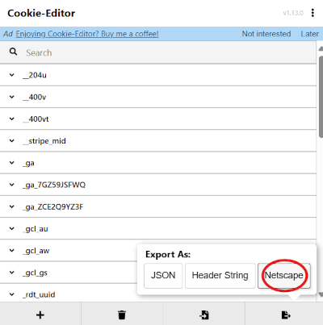
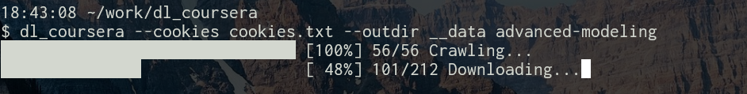

[](https://pypi.org/project/dl-coursera/)[](https://github.com/FLZ101/dl_coursera/actions/workflows/test-single.yml)[](https://github.com/FLZ101/dl_coursera/blob/master/LICENSE.txt)[](https://github.com/psf/black)

## Features

- [x] Download lectures (videos, subtitles, slides)
- [x] Download reading materials
- [x] Download quizzes
- [ ] Download jupyter notebooks
- [x] Generate a playlist for each course
- [x] Select subtitle language(s)

## Install

Python **⩾3.10** is required.

Install the `dl_coursera` package in a virtual environment.

```
$ pip install -U dl_coursera
$ dl_coursera --version
```

Alternatively, you can download `dl_coursera` as a single executable from [https://github.com/FLZ101/dl_coursera/releases/](https://github.com/FLZ101/dl_coursera/releases/). **Note**:

* This may not work if your OS is outdated
* On Windows, SmartScreen may prevent execution of the executable

## How-to

1. Get the cookies file

   Sign into [Coursera](https://www.coursera.org/), then use a browser extension to export cookies as a cookies file which will expire in about two weeks.

   For Chrome/Edge/Firefox, you can use the **Cookie-Editor** extension.

   

2. Enroll

   Navigate to homepage of the **specialization**/**course** you'd like to download, you can see its **slug** at the address bar. **Enroll** in.

   

3. Download

   To download a specialization:

   ```
   dl_coursera --cookies path_of_the_cookies_file --outdir output_directory --spec slug
   ```

   To download a course:

   ```
   dl_coursera --cookies path_of_the_cookies_file --outdir output_directory slug
   ```

   For each course, a `playlist.m3u` file is generated in the course directory. It lists the downloaded videos and can be opened with VLC, mpv, or other video players.

   ---

   Extra options:

   * `--quiz`: include quizzes
   * `--subtitles <languages>`: comma-separated subtitle language codes without spaces, e.g. `en,zh-CN`. Typical codes: `en`, `zh-CN`, `es`, `fr`, `de`, `pt-BR`, `ja`, `ko`, `ru`, `it`, `ar`, `hi`. Default: download the only available language; otherwise English if available.

   

## Note

* If math symbols do not render or images do not show in downloaded HTML files, the browser may be opening them from a Flatpak sandbox path such as `file:///run/user/1000/doc/...`, which prevents loading the local `resource/` files. Open the files with a non-Flatpak browser, drag the directory containing `resource/` into the browser window, or make the output directory accessible to the Flatpak sandbox.

## Troubleshooting

1. Check your network

2. Make sure you have enrolled in the specialization/course

3. If the cookies file might have expired, try getting a new one

4. Try upgrading to the latest version

5. Remove the directory `<output-directory>/<slug>/.cache` and try again

6. Visit [the issues page](https://github.com/FLZ101/dl_coursera/issues?q=is:issue). You may find a solution if others has encountered similar issues.

   Or you could create a new issue describing what is going wrong and the steps to reproduce it. Don't forget to attach the file `<output-directory>/<slug>/.cache/main.log` if it exists.

## Star History

[](https://www.star-history.com/?repos=flz101%2Fdl_coursera&type=date&legend=top-left)
